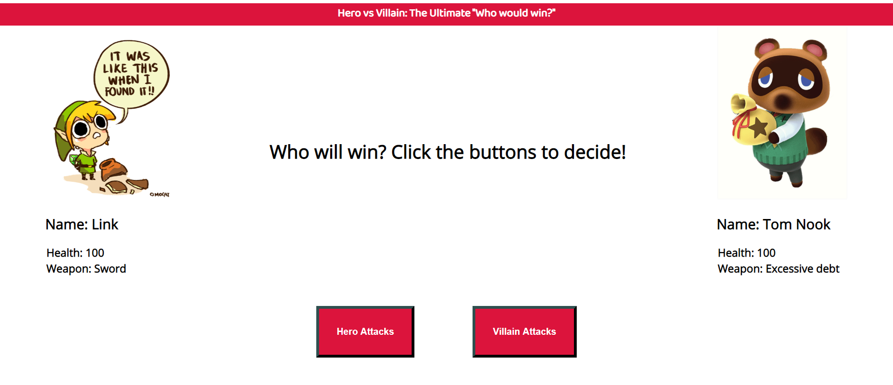

# hero-vs-villain

## Description
The user can enter a name for a hero and a name for a villian.  The user can have these two "fight" by clicking the corresponding buttons.  Once one of the fighters reaches 0 (or less) health, a winner is declared.  I suggest alternating button clicks to make the fight "fair." :)

## Future Possible Features
* Image for hero and villian changes based on the name that is entered (for example, if "Batman" is entered, a picture of Batman would be loaded)
